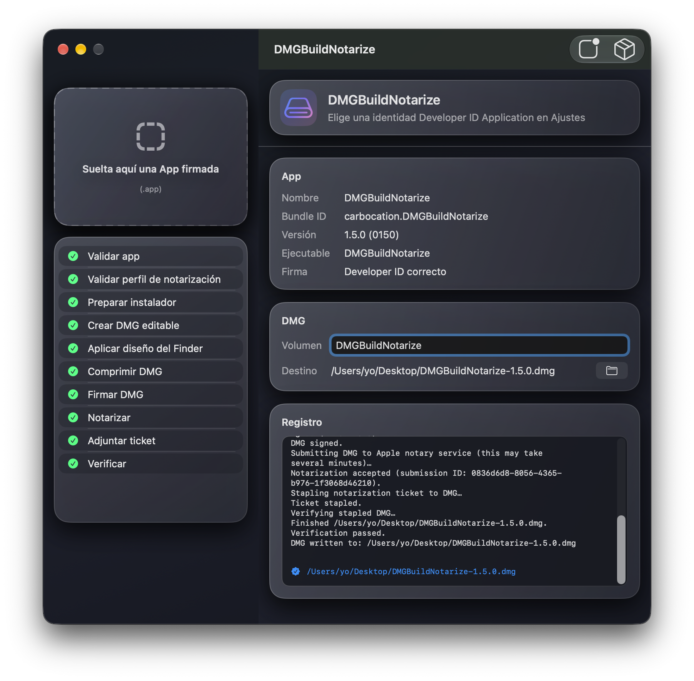
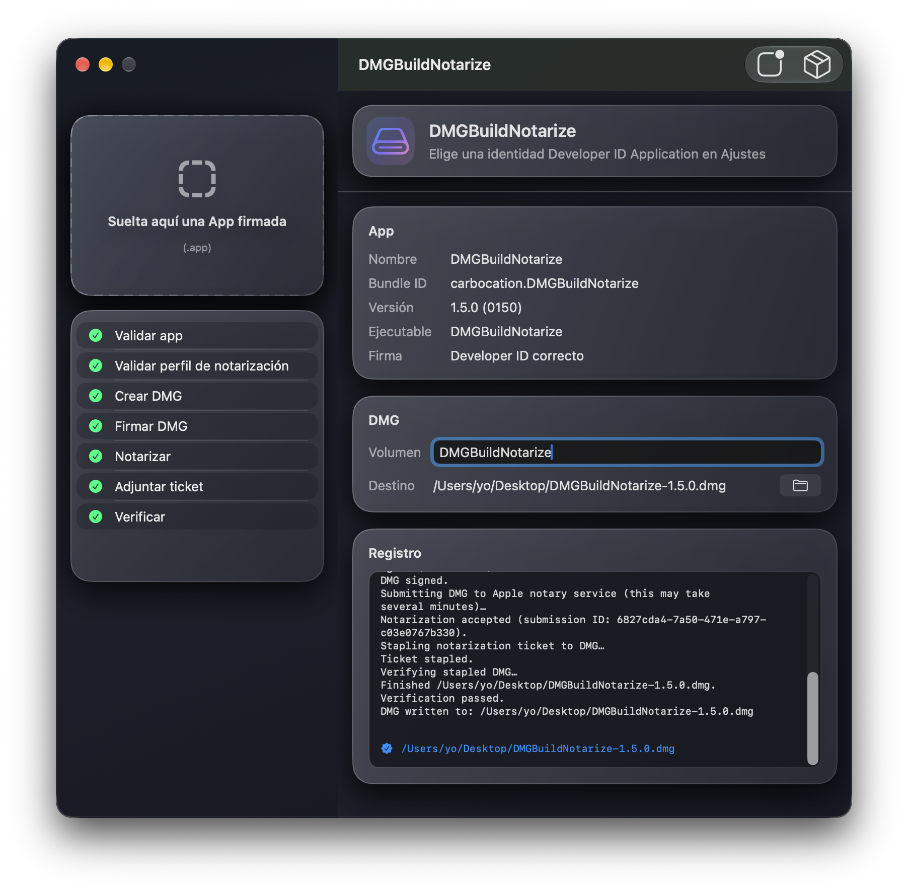
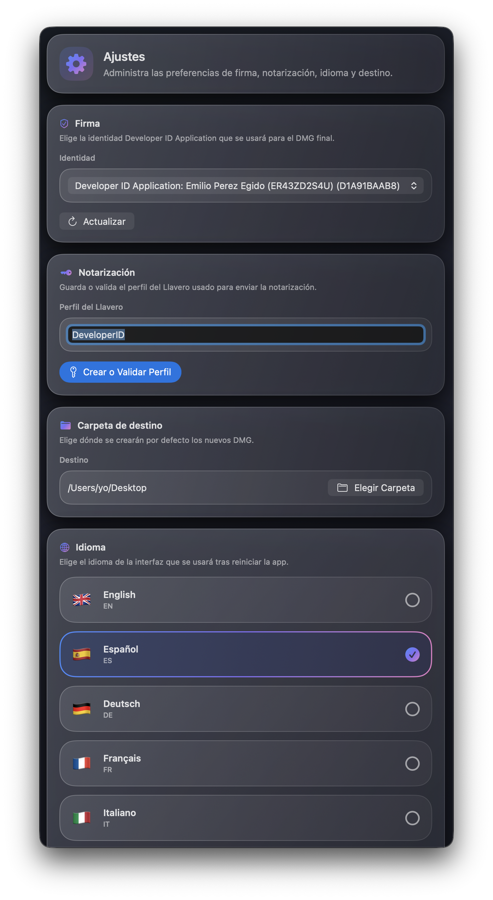

# DMGBuildNotarize


DMGBuildNotarize es una sencilla aplicación para Mac que convierte una `.app` firmada en un archivo `.dmg` estilizado, firmado y notarizado.

En pocas palabras: arrastra tu app para Mac, elige dónde debe guardarse la DMG, haz clic en **Crear DMG** y deja que la aplicación ejecute por ti los pasos de empaquetado y notarización de Apple.

| Uso de AppleScript |
|:----|
|  |

| Uso de create-dmg |
|:----|
|  |

## Prefacio

El principal mérito del código base corresponde a *carbocation* (James Pirruccello), autor del repositorio fuente [DMGBuildNotarize](https://github.com/carbocation/DMGBuildNotarize).

Estas son mis contribuciones al proyecto:

- Añadir estilo a la DMG: implementar un fondo personalizado (incluido como recurso de imagen empaquetado) con diseño mejorado de la ventana del Finder
- Dos opciones para crear el archivo DMG:
   - AppleScript: incluido en el repositorio original y disponible en todos los Mac; puede fallar en algunas versiones del sistema operativo, es lento y requiere permisos de automatización.
   - `create-dmg`: una herramienta externa gratuita que requiere Node.js; es fiable en todas las versiones de macOS, rápida y no requiere permisos especiales.
- Añadir la opción preferida de usar `create-dmg` para crear la ventana estilizada del Finder; si `create-dmg` no está instalada, la aplicación vuelve automáticamente al flujo basado en AppleScript
- Corregir la automatización del Finder en el modo de creación de DMG con AppleScript
- Añadir persistencia de credenciales: almacenamiento seguro en el Llavero para contraseñas específicas de app y persistencia en `UserDefaults` para los campos de credenciales de notarización
- Actualizar el icono de la aplicación siguiendo las directrices de Apple.
- Añadir un comportamiento explícito de cancelación/salida para cerrar la ventana de Ajustes
- Mejorar los mensajes del flujo de trabajo con actualizaciones de estado concisas
- Renovar el estilo `glass` de SwiftUI y la legibilidad en modo oscuro
- Integrar iconos de error y texto en los mensajes de registro en lugar de llevarlos a una etiqueta separada
- Añadir idiomas con selector de idioma integrado en la ventana de Ajustes
- Pulir la interfaz de Ajustes y añadir selección de idioma con confirmación de reinicio.

**Nota**: La primera vez que ejecutes la aplicación en modo AppleScript, un aviso informará al usuario de que «DMGBuildNotarize usa automatización del Finder para crear diseños personalizados de ventanas de instalador» y solicitará permiso para que DMGBuildNotarize envíe  Apple Events al Finder. Debes conceder este permiso para que la DMG se cree correctamente. No es necesario si la DMG se genera en modo `create-dmg`.

**Recomendación**: prueba la aplicación «tal cual», sin instalar `create-dmg`. Si obtienes archivos DMG estilizados con una disposición atractiva de la ventana del Finder, quédate con esa opción. Si los archivos DMG presentan la disposición básica y poco estética típica de los DMG estándar, instala `create-dmg`: el proceso de creación es considerablemente más rápido, no necesitas conceder permisos de automatización y las imágenes DMG siempre contarán con una disposición mejorada de la ventana del Finder.

## Complemento: create-dmg

DMGBuildNotarize ofrece dos formas de aplicar el diseño a la ventana del Finder de la DMG: AppleScript (implementado en el repositorio original) y [create-dmg](https://github.com/sindresorhus/create-dmg), de *Sindresorhus*, una herramienta de línea de comandos gratuita añadida recientemente que requiere tener instalado Node.js.

Cuando encuentra `create-dmg` en `/usr/local/bin/create-dmg` (Intel) o `/opt/homebrew/bin/create-dmg` (Apple Silicon), DMGBuildNotarize la utiliza en lugar del diseño del Finder basado en AppleScript. Es más rápido, no requiere permiso de Automatización y funciona de forma fiable en distintas versiones de macOS. Si `create-dmg` no está instalada, la aplicación vuelve automáticamente al flujo de AppleScript.

El requisito previo para disponer de `create-dmg` es tener instalado Node.js 20 o posterior. Una forma de instalar Node es mediante el gestor de paquetes Homebrew. Aunque supone un paso adicional frente a instalar Node directamente desde su propio instalador, puede ayudarte a evitar errores de permisos y otros problemas.

#### Instalar Homebrew:

```bash
/bin/bash -c "$(curl -fsSL https://raw.githubusercontent.com/Homebrew/install/HEAD/install.sh)"
```

#### Instalar Node:

`brew install node`

#### Instalar create-dmg:

- Ejecuta<br>`npm install --global create-dmg`
- Opcional: si recibes un mensaje sobre<br>`allow-scripts=fs-xattr,macos-alias`<br>ejecuta<br>`npm config set allow-scripts=fs-xattr,macos-alias --location=user`
- `create-dmg` estará disponible en `/usr/local/bin/create-dmg` (Mac Intel) o `/opt/homebrew/bin/create-dmg` (Mac con Apple Silicon).

#### Proceso de DMGBuildNotarize

La aplicación primero comprueba si `create-dmg` existe en el sistema; si es así, esa será la herramienta que cree el archivo DMG con un elegante diseño de ventana. Si no existe, recurre a AppleScript, que, aunque es más lento y menos fiable entre versiones de macOS, garantiza que al menos se creará el archivo DMG, con o sin una ventana estilizada del Finder.

#### Resultado

La imagen DMG creada por `create-dmg` tiene un diseño elegante que me gusta mucho y el proceso es muy rápido:

- 2 iconos: la app y un enlace a Aplicaciones
- Iconos de mayor tamaño
- Fondo con indicación de arrastrar y soltar
- Tamaño de ventana ajustado al fondo
- El icono de la imagen de disco abierta integra el icono de la aplicación.

|     |
|:---:|
|  |

### Ventana de ajustes

La interfaz de Ajustes y el selector de idioma se han rediseñado. Los flujos de configuración y de credenciales se ajustan al tratamiento visual de la ventana principal, añaden selección de idioma a nivel de aplicación con confirmación de reinicio y amplían las traducciones incluidas para que el nuevo selector pueda cambiar a idiomas adicionales compatibles.

|     |
|:---:|
|  |

---

# README original

## El problema

Distribuir una app para Mac fuera de la Mac App Store es más confuso de lo que parece.

Tu app puede funcionar perfectamente en tu propio ordenador, pero otro usuario aún puede ver una advertencia alarmante de macOS como «Apple no puede comprobar si contiene software malicioso». Normalmente, esto significa que la app no se ha empaquetado, firmado, notarizado o sellado correctamente para su distribución pública.

Los desarrolladores a menudo tienen que recordar una cadena de herramientas de línea de comandos:

- `codesign` para comprobar y firmar código
- `hdiutil` para crear la DMG
- Finder o AppleScript para que la DMG tenga un buen aspecto
- `notarytool` para enviar el archivo a Apple
- `stapler` para adjuntar el comprobante de aprobación de Apple
- `spctl` y `hdiutil verify` para comprobar el resultado final.

Cada herramienta es útil, pero es fácil equivocarse en el proceso completo.

## Qué hace esta app

DMGBuildNotarize reúne todo ese flujo en una pequeña aplicación de escritorio.

La aplicación:

- Comprueba que tu `.app` parece válida
- Comprueba que la app está firmada con un certificado Developer ID Application
- Crea una DMG estándar con tu app y un acceso directo a Aplicaciones
- Estiliza la ventana del Finder de la DMG con un fondo integrado, iconos más grandes y un diseño de arrastre a Aplicaciones (mediante `create-dmg` cuando está instalado o AppleScript como alternativa)
- Comprime la DMG
- Firma la DMG
- Envía la DMG a Apple para su notarización
- Sella el comprobante de notarización
- Verifica la DMG terminada.

El objetivo no es ocultar lo que sucede. La aplicación muestra cada paso e imprime la salida de los comandos, para que puedas seguir viendo qué ha funcionado o fallado.

Cuando DMGBuildNotarize estiliza la ventana del Finder, automáticamente:

- Abre la DMG montada en Finder
- Aplica una imagen de fondo personalizada con instrucciones de arrastre
- Ajusta el tamaño de la ventana para una presentación pulida, estilo instalador
- Coloca la app y el acceso directo a `Applications` para un flujo de arrastre de izquierda a derecha
- Guarda la disposición de la vista de iconos antes de desmontar y comprimir la imagen.

## Para quién es

Está pensado para desarrolladores que distribuyen aplicaciones para Mac directamente desde una web, una versión de GitHub, correo electrónico o cualquier lugar fuera de la Mac App Store.

No sustituye la compilación ni la firma de tu app que ya debe estar compilada y firmada para distribución antes de arrastrarla a DMGBuildNotarize.

## Requisitos

Necesitas:

- DMGBuildNotarize se ejecuta en macOS 14 o posterior
- Xcode 16 o posterior para compilar el proyecto
- Una cuenta de Apple Developer
- Un certificado Developer ID Application en tu Llavero
- Un perfil de Llavero para `notarytool`.

**Opcional — para un estilo de DMG más rápido y sin permisos:**

- Node.js 20 o posterior (instálalo mediante [Homebrew](https://brew.sh): `brew install node`).
- El paquete npm `create-dmg`: `npm install --global create-dmg`.

**Perfil de notarytool**

Si aún no tienes un perfil de `notarytool`, abre Ajustes en DMGBuildNotarize y utiliza **Crear o validar perfil**. El nombre de perfil predeterminado es `DeveloperID`.

## Cómo se usa

### En Xcode

Primero, crea una copia de tu app firmada para distribución.

1. Abre el proyecto de tu app para Mac en Xcode
2. Selecciona el destino de tu app
3. En **Signing & Capabilities**, elige tu equipo de Apple Developer
4. Asegúrate de que Xcode puede firmar la app con un certificado **Developer ID Application**
5. Elige **Product > Archive**
6. Cuando aparezca el archivo en Organizer, elige **Distribute App**
7. Elige **Direct Distribution**
8. Xcode subirá el archivo a Apple para su notarización
9. Tras aproximadamente un minuto, sitúa el puntero sobre el archivo de la app en Organizer
10. Elige **Export App** cuando esa opción esté disponible
11. Busca la `.app` en la carpeta que elegiste al exportarla.

Esta `.app` exportado es el que debes proporcionar a DMGBuildNotarize.

### En DMGBuildNotarize

Ahora convierte esta app firmada en la DMG pública final.

1. Abre DMGBuildNotarize
2. Abre Ajustes y elige tu identidad de firma Developer ID Application
3. Crea o valida tu perfil de Llavero para `notarytool`
4. Arrastra el paquete `.app` exportado a la ventana principal
5. Elige el nombre de la DMG y la carpeta de salida
6. Haz clic en **Crear DMG**
7. Espera a que todos los pasos aparezcan en verde.

Cuando termine, el archivo de salida es la DMG que puedes subir a tu página de publicación.

## Compilar desde el código fuente

Clona el repositorio, abre `DMGBuildNotarize.xcodeproj` en Xcode y ejecuta el esquema `DMGBuildNotarize`.

Para ejecutar las pruebas:

```sh
xcodebuild test -project DMGBuildNotarize.xcodeproj -scheme DMGBuildNotarize
```

## Notas

La notarización sigue pasando por Apple. Esto significa que la cuenta de Apple, el certificado, la firma de la app y el perfil de notarización deben ser válidos.

DMGBuildNotarize ayuda colocando los pasos en el orden correcto y haciendo que los fallos sean más fáciles de detectar.

## Licencia

DMGBuildNotarize está disponible bajo la licencia MIT. Consulta [LICENSE](LICENSE) para obtener más detalles.
