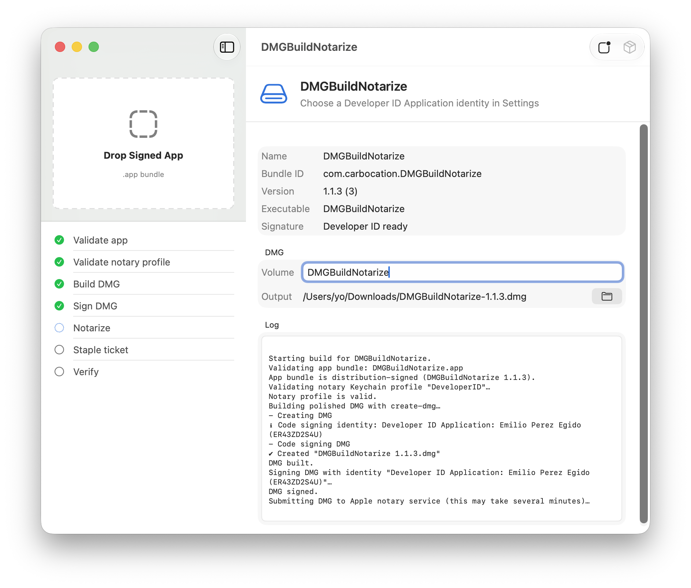

# DMGBuildNotarize

DMGBuildNotarize is a simple Mac app that turns a signed `.app` bundle into a polished, signed, notarized `.dmg` file.

In plain terms: drop in your Mac app, choose where the DMG should go, click **Build DMG**, and let the app run the packaging and Apple notarization steps for you.



## Preface

The main credits for the core code goes to *carbocation* (James Pirruccello), author of the source repository [DMGBuildNotarize](https://github.com/carbocation/DMGBuildNotarize).

These are my contributions to the project:

- Add DMG styling: implement custom DMG background (include bundled background image asset) with enhanced design of the Finder window
- Add the preferred option of using `create-dmg`to build the styled Finder window, this is faster, does not require Automation permission, and works reliably across macOS versions; if `create-dmg` is not installed, the app falls back to the AppleScript flow automatically.
- Add credentials persistence: add secure Keychain storage for app-specific passwords and UserDefaults persistence for notary credential fields
- Update the app icon asset following Apple guidelines
- Add explicit cancel/exit dismissal behavior to the settings view
- Improve workflow messaging with concise status updates.

## Add-on: create-dmg

DMGBuildNotarize offers two ways to apply the layout to the DMG Finder window: AppleScript (implemented in the original repository) and [create-dmg](https://github.com/sindresorhus/create-dmg) by *Sindresorhus*, recently added, free command line tool that requires Node.js to be installed.

When `create-dmg` is found at `/usr/local/bin/create-dmg` (Intel) or `/opt/homebrew/bin/create-dmg` (Apple Silicon), DMGBuildNotarize uses it instead of the AppleScript-based Finder layout. This is faster, does not require Automation permission, and works reliably across macOS versions. If `create-dmg` is not installed the app falls back to the AppleScript flow automatically.

The prerequisite to have `create-dmg` is Node.js 20 or later installed. One way to install Node is through the Homebrew package manager. While this is an extra step compared to installing Node directly from its own installer, it can help you avoid permissions errors and other issues.

#### Install Homebrew:

```bash
/bin/bash -c "$(curl -fsSL https://raw.githubusercontent.com/Homebrew/install/HEAD/install.sh)"
```

#### Install Node:

`brew install node`

#### Install create-dmg:

- Run<br>`npm install --global create-dmg` in Terminal
- Optional: If you get a message about<br>`allow-scripts=fs-xattr,macos-alias`<br>run<br>`npm config set allow-scripts=fs-xattr,macos-alias --location=user`
- `create-dmg` is available in `/usr/local/bin/create-dmg` (Intel Mac) or `/opt/homebrew/bin/create-dmg` (Silicon Mac).

#### DMGBuildNotarize process

The app first checks if `create-dmg` exists on the system, in which case it's the tool that builds the DMG file with an elegant windowed layout. If it doesn't exist, it falls back to AppleScript, which, although slower and less reliable across macOS versions, guarantees that at least the DMG file will be created, with or without a styled Finder window.

#### Result

The DMG image created by `create-dmg` has an elegant design that I really like and the process is really fast:

- 2 icons: app and Applications link
- larger icon size
- background with drag and drop indication
- window size adjusted to the background
- the open disk image icon has the application icon integrated.

|     |
|:---:|
|  |

---

## The Problem

Shipping a Mac app outside the Mac App Store is more confusing than it looks.

Your app might run perfectly on your own computer, but another user can still see a scary macOS warning like "Apple cannot check it for malicious software." That usually means the app was not packaged, signed, notarized, or stapled correctly for public distribution.

Developers often have to remember a chain of command-line tools:

- `codesign` to check and sign code
- `hdiutil` to create the DMG
- Finder or AppleScript to make the DMG look right
- `notarytool` to send the file to Apple
- `stapler` to attach Apple's approval ticket
- `spctl` and `hdiutil verify` to check the final result

Each tool is useful, but the full process is easy to get wrong.

## What This App Does

DMGBuildNotarize puts that whole flow into one small desktop app.

It:

- checks that your `.app` bundle looks valid
- checks that the app is signed with a Developer ID Application certificate
- creates a standard DMG with your app and an Applications shortcut
- styles the DMG Finder window with a built-in background, larger icons, and a drag-to-Applications layout (via `create-dmg` when installed, or AppleScript as fallback)
- compresses the DMG
- signs the DMG
- submits the DMG to Apple for notarization
- staples the notarization ticket
- verifies the finished DMG

The goal is not to hide what is happening. The app shows each step and prints the command output, so you can still see what succeeded or failed.

When DMGBuildNotarize styles the Finder window, it automatically:

- opens the mounted DMG in Finder
- applies a custom background image with drag instructions
- sizes the window for a polished installer-style presentation
- positions the app and `Applications` shortcut for a left-to-right drag flow
- saves the icon view layout before the image is detached and compressed

## Who It Is For

This is for developers who distribute Mac apps directly from a website, GitHub release, email, or any place outside the Mac App Store.

It is not a replacement for building or signing your app. Your `.app` should already be built and signed for distribution before you drop it into DMGBuildNotarize.

## Requirements

You need:

- DMGBuildNotarize runs on macOS 14+
- Xcode 16+ to build the project
- Apple Developer account
- Developer ID Application certificate in your Keychain
- `notarytool` Keychain profile

**Optional — for faster, permission-free DMG styling:**

- Node.js 20 or later (install via [Homebrew](https://brew.sh): `brew install node`)
- the `create-dmg` npm package: `npm install --global create-dmg`

**notarytool profile**

If you do not already have a `notarytool` profile, open Settings in DMGBuildNotarize and use **Create or Validate Profile**. The default profile name is `DeveloperID`.

## How To Use

### In Xcode

First, make a distribution-signed copy of your app.

1. Open your Mac app project in Xcode.
2. Select your app target.
3. In **Signing & Capabilities**, choose your Apple Developer team.
4. Make sure Xcode can sign the app with a **Developer ID Application** certificate.
5. Choose **Product > Archive**.
6. When the archive appears in Organizer, choose **Distribute App**.
7. Choose **Direct Distribution**.
8. Xcode will upload the archive to Apple for notarization.
9. After about a minute, move your pointer over the app archive in Organizer.
10. Choose **Export App** when that option becomes available.
11. Find the exported `.app` bundle.

That exported `.app` is what you give to DMGBuildNotarize.

### In DMGBuildNotarize

Now turn that signed app into the final public DMG.

1. Open DMGBuildNotarize.
2. Open Settings and choose your Developer ID Application signing identity.
3. Create or validate your `notarytool` Keychain profile.
4. Drop your exported `.app` bundle onto the main window.
5. Choose the DMG name and output folder.
6. Click **Build DMG**.
7. Wait for every step to turn green.

When it finishes, the output file is the DMG you can upload to your release page.

## Build From Source

Clone the repo, open `DMGBuildNotarize.xcodeproj` in Xcode, and run the `DMGBuildNotarize` scheme.

To run the tests:

```sh
xcodebuild test -project DMGBuildNotarize.xcodeproj -scheme DMGBuildNotarize
```

## Notes

Notarization still goes through Apple. That means the Apple account, certificate, app signature, and notarization profile all need to be valid.

DMGBuildNotarize helps by putting the steps in the right order and making failures easier to see.

## License

DMGBuildNotarize is available under the MIT License. See [LICENSE](LICENSE) for details.
